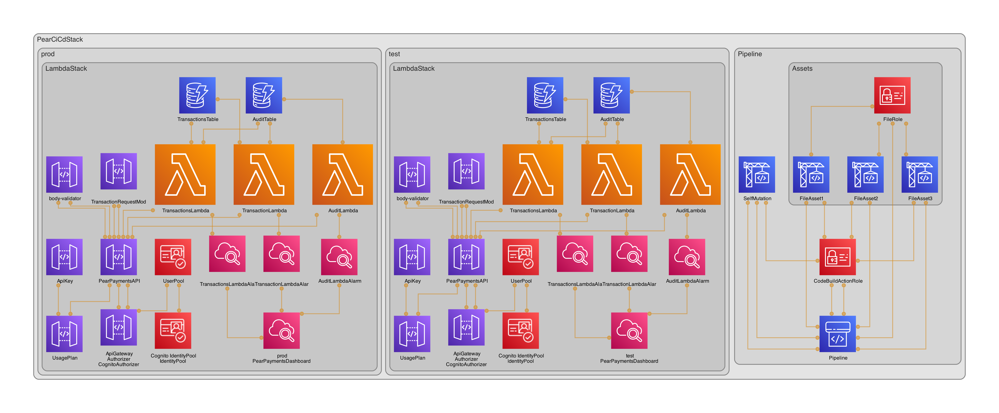

# 🍐 Pear Payments AWS CDK Stack

- [🍐 Pear Payments AWS CDK Stack](#-pear-payments-aws-cdk-stack)
  - [Introduction](#introduction)
  - [Basic Pipeline Flow](#basic-pipeline-flow)
  - [Resource Diagram](#resource-diagram)
  - [Prerequisites](#prerequisites)
  - [Installation](#installation)
  - [Deployment](#deployment)
  - [Testing](#testing)
  - [Usage](#usage)
  - [Lambda Endpoints](#lambda-endpoints)
    - [Transactions](#transactions)
    - [Audit](#audit)
  - [Design Decisions](#design-decisions)
  - [Out of Scope](#out-of-scope)
  - [Useful commands](#useful-commands)
  - [Cleanup](#cleanup)

## Introduction

This repository contains an AWS CDK (Cloud Development Kit) stack that deploys a serverless application for Pear Payments. The stack includes resources such as a DynamoDB table for storing transactions, an API Gateway for managing RESTful API endpoints, Lambda functions for processing transactions, and Cognito for authorization.

## Basic Pipeline Flow

GitHub -> trigger CodePipeline -> Test -> Deploy to `test` environment -> Manual Approval -> Deploy to Prod

## Resource Diagram



## Prerequisites

Before you can deploy this CDK stack, you need to have the following prerequisites:

- *Node.js and npm*: Make sure you have Node.js (>=14.15) and npm installed on your local machine. 📦

- *AWS CLI*: You should have the AWS CLI installed and configured with the necessary IAM permissions. 🔑

- *AWS CDK*: Install the AWS CDK using npm:

    ```bash
    npm install -g aws-cdk
    ```

- *GitHub Repository*: If you plan to use the CodePipeline for deployment, you need to set up a GitHub repository and configure webhooks for changes. 🐙

## Installation

1. Clone this repository to your local machine:

    ```bash
    git clone <https://github.com/chickenbeef/pear-cicd.git>
    ```

2. Change to the project directory:

    ```bash
    cd pear-cicd
    ```

3. Install dependencies:

    ```bash
    npm install
    ```

## Deployment

To deploy the CDK stack, run the following commands:

1. Update ./lib/constants.ts with your account and region details.

2. Bootstrap the account for CDK:

    ```bash
    cdk bootstrap
    ```

3. Deploy the CDK stack:

    ```bash
    cdk deploy
    ```

The CDK stack will create the specified resources in your AWS account. ☁️

## Testing

A sample test is included. Run `npm run test` to run your tests. 🧪

## Usage

Once the CDK stack is deployed, you will need to create a user and confirm them in Cognito. Once the user is authorized via Cognito, the token can be sent to API Gateway to interact with the Pear Payments Lambda. You will also receive an API Key to authenticate your requests. The key ID can be found in the stack outputs or in the terminal after deploying the stack. 🚀

## Lambda Endpoints

### Transactions

- Create Transaction  
    POST
    `/transactions`

- Get All Transactions  
    GET
    `/transactions`

### Audit

- Get All Audit entries  
    GET
    `/audit`

## Design Decisions

There are no dependent resources in the custom VPC, therefore, the VPC was not used and a bastion is not required. Lambda and DynamoDB run in the AWS network and authentication is with IAM.

DynamoDB was chosen for its scalibility, high availability and low latency required for payment transactions.

Cognito is used for OAuth 2.0 authorisation and since this exercise is for an API only, Cognito was configured with a Hosted UI.

## Out of Scope

The following was left out due to time constraints:

- Fine grained access control with Cognito groups
- WAF to mitigate attacks
- DDB backups, replication, encryption
- Field validation in Lambda functions
- Custom domain
- Caching
- +every other feature of the services used :)

The following was left out due to being not needed:

- EC2 bastion
- Lambda in a VPC

## Useful commands

- `npm run build`   compile typescript to js
- `npm run watch`   watch for changes and compile
- `npm run test`    perform the jest unit tests
- `cdk deploy`      deploy this stack to your default AWS account/region
- `cdk diff`        compare deployed stack with current state
- `cdk synth`       emits the synthesized CloudFormation template

## Cleanup

To remove the CDK stack and associated resources, run the following command:

```bash
cdk destroy
```

This will remove all the resources created by the CDK stack. 🧹
